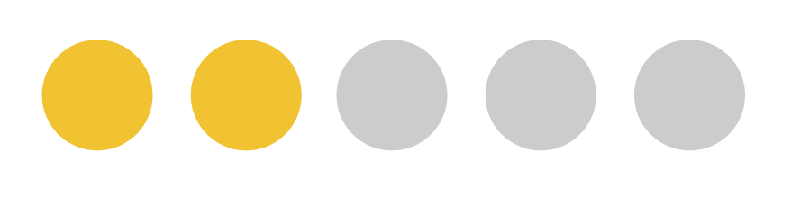
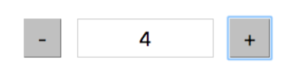
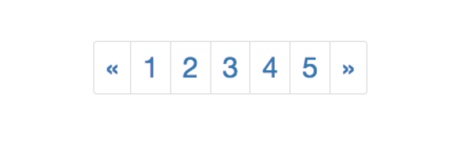
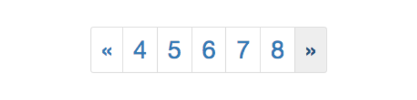

# Ejercicio - React Katas

## #1. Círculos

Crear varios círculos en pantalla, cuando se clica sobre ellos deben cambiar de color.

Guía:

- crear el círculo como un componente (`Circle`)
- utilizar useState para establecer un estado seleccionado (`true` / `false`)
- utilizar el evento `onClick` del círculo para ejecutar la función que modifica el state
- condicionar el estilo del círculo al valor del state



## #2. Input numérico

Crear dos botones y un campo `<input>` como en la figura.

El valor inicial del campo `<input>` deberá ser 0.

Al clicar sobre el boton “+” debe sumar una unidad.
Al clicar sobre el boton “-” debe restar una unidad.

Limitar los valores posibles a números enteros de 0 a 10.

Nota: el campo `<input>` no debe ser editable directamente por el usuario



## #3. Thumbs up/down

Utilizando la librería Font Awesome, mostrar un icono que cambie de `icon1` a `icon2` al pulsar con el ratón.

```jsx
<FlipIcon icon1="fa-thumbs-up" icon2="fa-thumbs-down" />
```

## #4. Números

Debemos crear un elemento como el siguiente:



Deberán añadirse las clases y la funcionalidad necesarias para que cuando cliquemos sobre `<<` reste una unidad a todos los números, y cuando cliquemos en `>>` sume una unidad:



Sólo debe permitir moverse entre 0 y 20.

Al hacer clic sobre un número, el número debe aparecer en grande en algún punto de la pantalla.
